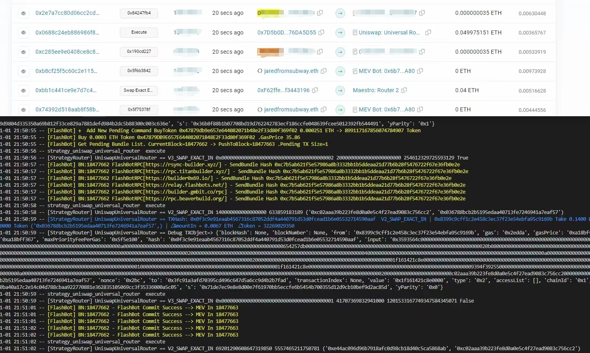

## Ethereum MEV Bot (PoC)


#### Run Bot

###### 1.config `mev_bot_env_mainnet` file

```

    export pk=<your wallet private key>
    export mevbot=<contract address>
    export singer_pk=<anything pk>

    #  Enable for MEV
    export min_mev_eth_amount=0.005
    export max_mev_eth_amount=0.2
    export min_gas_profit_rate=0.005

    #  Enable for Debug
    export debug_in_goerli=0
    export debug_strategy_watch=0
    export debug_strategy_log=0
    export debug_simulate_output=0
    export disable_flashbot_commit=0
    export disable_flashbot_simulate=0

```

and then

```

    source ./mev_bot_env_mainnet

```

###### 2.deploy mev bot contract

```

    cd mevbot_contract
    vim ./hardhat.config.js

```

modify eth mainnet rpc url

```

    require("@nomicfoundation/hardhat-toolbox");

    /** @type import('hardhat/config').HardhatUserConfig */
    module.exports = {
    defaultNetwork: "localhost",
    networks: {
        eth_goerli: {
        url: "https://winter-necessary-county.ethereum-goerli.quiknode.pro//",
        ethNetwork: 'goerli',
        accounts: [ process.env.pk ],
        gasPrice: 20000000000   ///  20Gwei
        },
        eth: {
        url: "https://burned-sly-dew.quiknode.pro//", <<<<====  Here
        ethNetwork: 'mainnet',
        accounts: [ process.env.pk ],
        },
    },
    solidity: "0.8.4",
    };

```

and then

```

    npx hardhat run --network eth scripts/deploy.js

```

###### 3.modify config file

add mevbot address to `mev_bot_env_mainnet`

```

    export mevbot=<contract address>

```

and then,source it again

```

    source ./mev_bot_env_mainnet

```

###### 4.add your ethereum rpc url

add ethereum http rpc url at `main.py:271`

```

    remote_rpc_url = 'https://sparkling-quiet-mountain.quiknode.pro//'   <<<<  Here

```

add ethereum websock rpc url(support get mempool tx) at `websock_api.txt`

```

    wss://eth-mainnet.g.alchemy.com/v2/bq4QpOwwK6XmMj2ic46CvZGXGnfpBZFx
    wss://eth-mainnet.g.alchemy.com/v2/BsPdNQFqtT40X1b6ExTyYARn9E7d0Zwf
    wss://eth-mainnet.g.alchemy.com/v2/YApm5Lnf52t6Fjhiy-W6dCjWrmT8_Hhn
    wss://eth-mainnet.g.alchemy.com/v2/vvw3ExvPCUmR-CObjfOLbr_-6I5b7BBd
    wss://eth-mainnet.g.alchemy.com/v2/lfpJ7lraK0zemOnbYbgTZxamCdzp2rit

```

###### 5. Run Bot

install requirement

```

    pip install -r ./requirement

```

run bot

```

    python3 ./main.py

```

## Core Code

`match_entry()`
`eth_buy_token_calculate_eth_profit_with_expect_min_token()`
`tx_broadcast()`

## Sample


